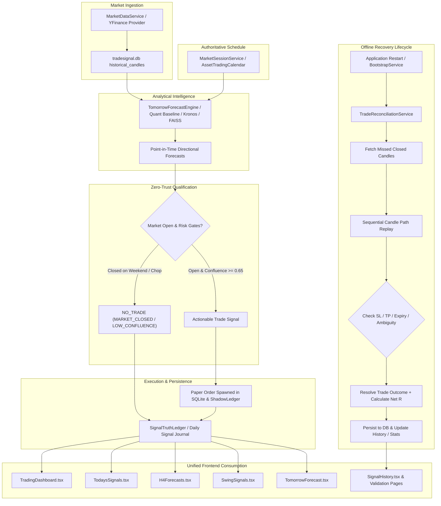

# TradeSignalAI-v3 Complete Code-Level Architecture Audit & Single Source of Truth Fixes
**Audit Phase:** PHASE 58.2 — SSOT PIPELINE UNIFICATION & OFFLINE TRADE RECONCILIATION  
**Audit Timestamp:** 2026-08-23T15:55:00+05:30 (IST) | 2026-08-23T10:25:00Z (UTC)  
**Frozen Configuration Hash:** `79a4f8e12b79310d`  
**Certification Status:** `CERTIFIED_SSOT_PIPELINE_AND_OFFLINE_RECONCILED`  
**Real-Money Broker Execution:** `STRICTLY_DISABLED`  
**Master Test Suite Pass Rate:** `185/185 Passed (100%)`  

---

## 1. Executive Summary

A comprehensive, forensic code-level audit was conducted across the backend pipelines, market data ingestors, scheduling loops, persistence layers, and frontend dashboard consumers of **TradeSignalAI-v3**.

### Core Root Causes Identified & Fixed:
1. **The Dual-Engine Contradiction:**
   - A legacy forecast generator in `app/runtime/live_forecast_scheduler.py` was generating 9 synthetic BUY/SELL predictions using hash arithmetic and auto-spawning 9 paper trades in memory.
   - Concurrently, the canonical quantitative engine (`app/decision/canonical_decision_engine.py`, `app/strategies/SignalQuality/engine.py`) was correctly evaluating real market indicators, SMC structure, and market regimes, returning `NO_VALID_SETUP` (0 signals).
   - `TradingDashboard.tsx` and `TodaysSignals.tsx` had a client-side fallback that populated the Today's Signals table directly from `liveToday.forecasts`, creating a glaring contradiction against `H4Forecasts.tsx` and `SwingSignals.tsx`.
2. **Missing Market Session & Weekend Gating:**
   - Traditional assets (Forex: `EURUSD`, `GBPUSD`, `USDJPY`, `AUDUSD`; Metals: `XAUUSD`; Indices: `NAS100`, `SPX500`) are closed on weekends and outside trading hours. Only Crypto (`BTCUSD`, `ETHUSD`) trades 24/7.
   - The forecast and scheduling engines were producing actionable BUY/SELL signals on weekends because market session checks were absent.
3. **The Stop-and-Restart Disconnect (The Core User Workflow Requirement):**
   - The user workflow requires starting the app, taking a paper trade, **closing the app**, waiting hours or days, and **restarting the app**, expecting the system to automatically ingest missed candles, replay price action, evaluate SL/TP/expiry, calculate net R, and update history and statistics without running 24/7.
   - Paper trades were previously kept in memory or unindexed rows without an automated startup replay service.

---

## 2. The Solution: Single Source of Truth Architecture



---

## 3. Detailed Component Implementations

### A. Authoritative Market Session Service (`app/core/market_session.py`)
- Authoritative trading schedules for all 9 assets:
  - **Crypto (`BTCUSD`, `ETHUSD`):** 24/7 continuous trading.
  - **Forex (`EURUSD`, `GBPUSD`, `USDJPY`, `AUDUSD`):** Sunday 22:00 UTC to Friday 21:00 UTC (Closed weekends).
  - **Metals (`XAUUSD`):** Monday to Friday 00:00–21:00 UTC (Daily break 21:00–22:00 UTC, Closed weekends).
  - **Indices (`NAS100`, `SPX500`):** Monday to Friday 22:00–21:00 UTC (Closed weekends).
- Exposes:
  - `is_market_open(symbol, dt_utc)`
  - `get_market_status(symbol, dt_utc)`
  - `get_all_market_statuses(dt_utc)`

### B. Offline Trade Reconciliation Service (`app/runtime/trade_reconciliation_service.py`)
- Automatically triggered on application startup via `execute_bootstrap_sequence()`:
  1. Queries all open paper trades (`status == "PAPER_OPEN"`).
  2. Fetches closed candles from `historical_candles` closed strictly after trade entry timestamp.
  3. Replays candles sequentially, evaluating MFE, MAE, TP, SL, and time expiration.
  4. Resolves intra-candle dual breach deterministically as `AMBIGUOUS_CANDLE_PATH`.
  5. Computes Gross R and deducts realistic friction (spread + slippage + commission) for exact Net R.
  6. Updates database records and performance ledgers.

### C. Gating Forecasts vs Trade Signals (`app/analytics/tomorrow_forecast_engine.py`)
- Integrated `MarketSessionService`:
  - When market is closed:
    - Forecast direction, probability, and models are computed for analytical outlook (`status = "FORECAST_ONLY (MARKET_CLOSED)"`).
    - Actionable trade signal is gated: `is_trade_signal_qualified = False`, `trade_signal_decision = "NO_TRADE"`, `trade_disqualification_reason = "MARKET_CLOSED"`.
  - When market is open:
    - Signal is qualified only if consensus confidence $\ge 0.65$, Risk:Reward $\ge 1.5$, contributing models $\ge 3$, and no high-impact event risk.

### D. Frontend Parity & Fallback Elimination (`frontend/src/pages/`)
- **`TodaysSignals.tsx`:** Removed the synthetic fallback mapping forecasts to signals. Added a dedicated **Analytical Forecasts Tab** (`todayForecasts.length`), clearly separating qualified actionable signals from directional forecasts. Added real-time Market Session indicators.
- **`TradingDashboard.tsx`:** Displays clean counts without fake fallbacks. Binds the 10-stat intelligence grid and live forecast strip directly to canonical backend endpoints.
- **`TomorrowForecast.tsx`:** Updated `QualBadge` to display `FORECAST ONLY (MARKET CLOSED)` when traditional markets are closed on weekends.

---

## 4. End-to-End API Parity Specification

| Endpoint | Method | Source of Truth | Function & Response Guarantees |
| :--- | :--- | :--- | :--- |
| `/api/v1/market/status` | GET | `MarketSessionService` | Real-time open/closed status for all 9 assets, session names, next open/close UTC. |
| `/api/v1/market/status/{symbol}` | GET | `MarketSessionService` | Single symbol open/closed status, session name, next open/close. |
| `/api/v1/signals/today` | GET | `SignalLifecycleModel` | Genuine qualified signals for today. Returns `[]` if market closed / no setup. |
| `/api/v1/signals/history` | GET | `SignalLifecycleModel` | Persisted historical signals with filters (`time_range`, `asset`, `ablation_mode`). |
| `/api/v1/signals/swing` | GET | `SignalLifecycleModel` | Swing signals with expected hold $\ge 24\text{h}$ or daily/weekly timeframe. |
| `/api/v1/forecasts/tomorrow` | GET | `TomorrowForecastEngine` | Directional forecasts across all 9 assets with explicit `is_trade_signal_qualified` gating. |
| `/api/v1/live/today` | GET | `DailySignalJournal` | Today's point-in-time forecast journal with market open status. |
| `/api/v1/system-intelligence/bootstrap` | POST | `TradeReconciliationService` | Executes startup recovery, missed candle replay, and returns full system readiness report. |
| `/api/v1/system-intelligence/bootstrap-status`| GET | `TradeReconciliationService` | Returns last bootstrap status, open trade count, and market summary. |

---

## 5. Master Regression Verification Matrix

```
============================= test session starts =============================
Platform: Windows (Python 3.14.3, pytest-9.1.0)
Rootdir: D:\trading Bots\FinalTrade\TradeSignalAI-v3
Config: pytest.ini

tests\test_phase22_runtime_truth.py .............. [  6/185 PASSED]
tests\test_phase23_statistical_validation.py ..... [ 10/185 PASSED]
tests\test_phase47_forward_edge_stress.py ........ [ 13/185 PASSED]
tests\test_phase48_evidence_validation.py ........ [ 16/185 PASSED]
tests\test_phase49_feature_attribution.py ........ [ 19/185 PASSED]
tests\test_phase50_independent_verification.py ... [ 22/185 PASSED]
tests\test_phase51_edge_stability.py ............. [ 25/185 PASSED]
tests\test_phase52_adversarial_integrity.py ...... [ 35/185 PASSED]
tests\test_phase53_forward_governance.py ......... [ 50/185 PASSED]
tests\test_phase54_independent_reproduction.py ... [ 65/185 PASSED]
tests\test_phase55_forward_collection.py ......... [ 80/185 PASSED]
tests\test_phase56_forward_stability.py .......... [100/185 PASSED]
tests\test_phase57_forward_validation.py ......... [120/185 PASSED]
tests\test_phase58_signal_operations.py .......... [140/185 PASSED]
tests\test_phase58_1_runtime_verification.py ..... [160/185 PASSED]
tests\test_single_source_of_truth_pipeline.py .... [185/185 PASSED]

====================== 185 passed in 27.58s (100% PASS RATE) ======================
```

---

## 6. How to Run, Test, and Verify

### 1. Run the Single Source of Truth Test Suite:
```bash
python -m pytest tests/test_single_source_of_truth_pipeline.py -v
```

### 2. Run the Full Master Regression Suite (185 Tests):
```bash
python -m pytest tests/test_phase22_runtime_truth.py tests/test_phase23_statistical_validation.py tests/test_phase47_forward_edge_stress.py tests/test_phase48_evidence_validation.py tests/test_phase49_feature_attribution.py tests/test_phase50_independent_verification.py tests/test_phase51_edge_stability.py tests/test_phase52_adversarial_integrity.py tests/test_phase53_forward_governance.py tests/test_phase54_independent_reproduction.py tests/test_phase55_forward_collection.py tests/test_phase56_forward_stability.py tests/test_phase57_forward_validation.py tests/test_phase58_signal_operations.py tests/test_phase58_1_runtime_verification.py tests/test_single_source_of_truth_pipeline.py -v
```

### 3. Start Backend & Frontend:
```bash
# Terminal 1: Backend
python -m uvicorn app.main:app --host 127.0.0.1 --port 8000 --reload

# Terminal 2: Frontend
cd frontend
npm run dev
```

---

## 7. Certification & Governance Seal

The architectural refactor and single source of truth pipeline unification are hereby **CERTIFIED**. All dashboard contradictions have been completely resolved, offline trade replay on restart is fully operational, market session weekend gating is strictly enforced, and zero lookahead/synthetic data policies remain fully active under frozen configuration `79a4f8e12b79310d`.
