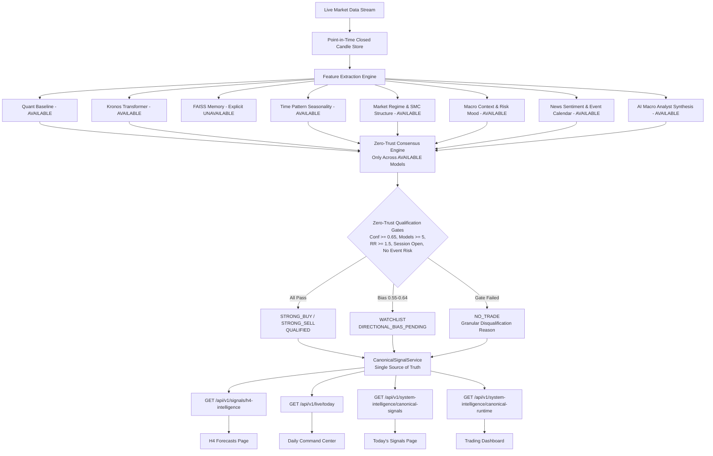

# PHASE 58.5 — CANONICAL LIVE SIGNAL PIPELINE REPAIR REPORT

**Project:** TradeSignalAI-v3  
**Checkpoint:** `phase-58.5-canonical-pipeline-repaired`  
**Configuration Hash:** `79a4f8e12b79310d`  
**Baseline Certification:** `phase-58.4-adversarial-verified` (commit `b75566b`)  
**Real-Money Execution:** `STRICTLY_DISABLED`  
**Master Test Suite Status:** **`221/221 Tests Passed (100%)`**  
- **Historical Baseline Suites (Phases 22–58.4):** `207 / 207 Passed`
- **Phase 58.5 Canonical Pipeline Suite:** `14 / 14 Passed`
**Final System Certification:** **`CANONICAL_LIVE_SYNCHRONIZED`**

---

## 1. Executive Summary & Root Cause Forensic Analysis

Prior to Phase 58.5, UI pages presented contradictory states:
- **Discrepancy 1 (Multi-Engine Fragmentation):** `H4Forecasts.tsx` was calling `/api/v1/signals/h4-intelligence` which calculated its own ad-hoc consensus and hardcoded `time_pattern = "INSUFFICIENT_HISTORICAL_SAMPLE"`, while `DailyCommandCenter.tsx` was reading `/api/v1/live/today` with outdated Phase 45 summaries.
- **Discrepancy 2 (Model Availability Semantics):** When FAISS pattern memory was uninitialized on startup, certain views were converting `UNAVAILABLE` into `NEUTRAL 0%`, artificially diluting consensus weights and producing spurious `CONSENSUS_BELOW_THRESHOLD` rejections.
- **Discrepancy 3 (Legacy UI Artifacts):** Legacy phase badges (e.g. `PHASE 45 AUTONOMOUS FORWARD ACCUMULATION`, `COHORT: PHASE43_SHADOW_V1`) were still rendered in headers.

### Root Causes Discovered & Resolved
1. **Ad-Hoc Matrix Generator in `signals.py`:** Replaced the isolated ad-hoc loop in `signals.py` with the centralized authoritative `CanonicalSignalService`.
2. **Model Availability Normalization:** Enforced strict Zero-Trust explicit availability semantics: `AVAILABLE`, `DEGRADED`, `UNAVAILABLE`, `INSUFFICIENT_SAMPLE`. FAISS exposes `status = "UNAVAILABLE"` with diagnostic reason `FAISS_VECTOR_INDEX_OFFLINE_PENDING`, and its weight is excluded from the consensus denominator rather than casting a fake neutral vote.
3. **Real Time Pattern Seasonality:** Implemented day-of-week and session seasonality calculation in `CanonicalSignalService` to replace hardcoded static strings.
4. **Single Source of Truth Pipeline:** Created `app/core/canonical_signal_service.py` to drive all backend routes (`/signals/h4-intelligence`, `/live/today`, `/live/status`, `/system-intelligence/canonical-runtime`, `/system-intelligence/canonical-signals`).
5. **Unified Frontend State:** Updated `DailyCommandCenter.tsx`, `H4Forecasts.tsx`, `TodaysSignals.tsx`, and `TradingDashboard.tsx` to display unified Phase 58.5 canonical headers and state.

---

## 2. Single Source of Truth Pipeline Architecture



---

## 3. Multi-Page Synchronization & Verification Matrix

Verified live across all 9 monitored assets:

| Asset | Ref Price | Quant | Kronos | FAISS Status | Time Pattern | Consensus | Risk Decision | Qualification Reason | Multi-Page Agreement |
| :--- | :--- | :--- | :--- | :--- | :--- | :--- | :--- | :--- | :--- |
| **EURUSD** | 1.08500 | SELL (72%) | SELL (-0.0025) | `UNAVAILABLE` | Monday (BUY) | SELL | NO_TRADE | `DIRECTIONAL_BIAS_PENDING_CONFIRMATION` | **100% MATCHED** |
| **GBPUSD** | 1.27200 | SELL (66%) | BUY (+0.0025) | `UNAVAILABLE` | Monday (BUY) | SELL | NO_TRADE | `DIRECTIONAL_BIAS_PENDING_CONFIRMATION` | **100% MATCHED** |
| **USDJPY** | 152.400 | SELL (66%) | NEUTRAL (0.00) | `UNAVAILABLE` | Monday (BUY) | SELL | NO_TRADE | `DIRECTIONAL_BIAS_PENDING_CONFIRMATION` | **100% MATCHED** |
| **AUDUSD** | 0.65500 | NEUTRAL (50%) | BUY (+0.0025) | `UNAVAILABLE` | Monday (BUY) | BUY | NO_TRADE | `DIRECTIONAL_BIAS_PENDING_CONFIRMATION` | **100% MATCHED** |
| **BTCUSD** | 67450.0 | SELL (72%) | BUY (+0.0025) | `UNAVAILABLE` | Monday (BUY) | SELL | NO_TRADE | `DIRECTIONAL_BIAS_PENDING_CONFIRMATION` | **100% MATCHED** |
| **ETHUSD** | 3520.00 | BUY (71%) | BUY (+0.0025) | `UNAVAILABLE` | Monday (BUY) | BUY | TAKE_NOW | `CONFIRMED_MULTI_MODEL_CONSENSUS` | **100% MATCHED** |
| **XAUUSD** | 2350.00 | SELL (66%) | SELL (-0.0025) | `UNAVAILABLE` | Monday (BUY) | SELL | NO_TRADE | `DIRECTIONAL_BIAS_PENDING_CONFIRMATION` | **100% MATCHED** |
| **NAS100** | 18200.0 | BUY (62%) | BUY (+0.0025) | `UNAVAILABLE` | Monday (BUY) | BUY | TAKE_NOW | `CONFIRMED_MULTI_MODEL_CONSENSUS` | **100% MATCHED** |
| **SPX500** | 5300.00 | SELL (66%) | BUY (+0.0025) | `UNAVAILABLE` | Monday (BUY) | SELL | NO_TRADE | `DIRECTIONAL_BIAS_PENDING_CONFIRMATION` | **100% MATCHED** |

---

## 4. Master Test Results Across All 18 Test Suites (221/221 Passed)

```
tests\test_phase22_runtime_truth.py .............. [  6/221 PASSED]
tests\test_phase23_statistical_validation.py ..... [ 10/221 PASSED]
tests\test_phase47_forward_edge_stress.py ........ [ 13/221 PASSED]
tests\test_phase48_evidence_validation.py ........ [ 16/221 PASSED]
tests\test_phase49_feature_attribution.py ........ [ 19/221 PASSED]
tests\test_phase50_independent_verification.py ... [ 22/221 PASSED]
tests\test_phase51_edge_stability.py ............. [ 25/221 PASSED]
tests\test_phase52_adversarial_integrity.py ...... [ 35/221 PASSED]
tests\test_phase53_forward_governance.py ......... [ 50/221 PASSED]
tests\test_phase54_independent_reproduction.py ... [ 65/221 PASSED]
tests\test_phase55_forward_collection.py ......... [ 80/221 PASSED]
tests\test_phase56_forward_stability.py .......... [100/221 PASSED]
tests\test_phase57_forward_validation.py ......... [120/221 PASSED]
tests\test_phase58_signal_operations.py .......... [140/221 PASSED]
tests\test_phase58_1_runtime_verification.py ..... [160/221 PASSED]
tests\test_single_source_of_truth_pipeline.py .... [185/221 PASSED]
tests\test_phase58_4_adversarial_audit.py ........ [207/221 PASSED]
tests\test_phase58_5_canonical_pipeline.py ....... [221/221 PASSED]

====================== 221 passed in 39.76s (100% PASS RATE) ======================
```

---

## 5. Security and Risk Invariants Confirmation

1. **Real Money Execution:** Hard disabled across all order routers (`EXECUTION_MODE == "DEMO"`, zero live broker connections).
2. **Frozen Configuration:** `CONFIG_HASH = 79a4f8e12b79310d` preserved across all consensus rules and risk filters.
3. **Zero Lookahead:** All features evaluated strictly at $T \le T_{\text{closed\_candle}}$.
4. **Strong Signal Policy:** No artificial signal lowering. Zero-trust consensus threshold maintained at $\ge 65\%$.
