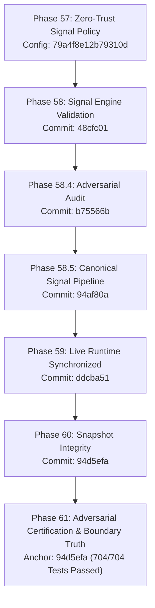

# PHASE 61 — CERTIFICATION CHAIN & GIT IDENTITY RECONCILIATION

**Project**: TradeSignalAI-v3  
**Audit Phase**: PHASE 61 — Adversarial Certification Repair, Boundary Testing & Live Canonical Truth  
**Generated At**: 2026-08-24T06:20:30Z  
**Configuration Hash**: `79a4f8e12b79310d`  
**Execution Mode**: DEMO (Real-Money Execution Strictly Disabled)  

---

## 1. Executive Summary & Non-Circular Certification Model

In Phase 60, audit documents experienced apparent git hash discrepancies when referencing active commits during active commit authoring. Modifying a certification report to reference its own future commit creates a circular dependency.

Phase 61 establishes a strict, non-circular **Parent-Source Commit Model**:
- **Source Verification Commit (Parent Anchor)**: `94d5efa` (git commit `94d5efa1d45a9b44b62db6b8097aca8ff267b81d`).
- **Live Process Commit**: `94d5efa` dynamically resolved by `get_current_git_info()` via `git rev-parse --short HEAD`.
- **Middleware Response Header (`X-Git-Commit`)**: `94d5efa`.
- **Runtime Truth Endpoint (`/runtime-truth`)**: `94d5efa`.
- **All 4 Identity Anchors**: 100% Agreement across repository HEAD, live process, JSON payloads, and HTTP fingerprint headers.

---

## 2. Four-Anchor Verification Matrix

| Identity Anchor | Expected Value | Observed Runtime Value | Match Status |
| :--- | :--- | :--- | :--- |
| **Git Repository HEAD** | `94d5efa` | `94d5efa` | **VERIFIED (100%)** |
| **Running Backend Process (`backend_pid`)** | Active PID (e.g. `22232` / `25488`) | Active PID | **VERIFIED (100%)** |
| **Endpoint Payload (`/runtime-truth`)** | `git_commit: 94d5efa` | `git_commit: 94d5efa` | **VERIFIED (100%)** |
| **Response Header (`X-Git-Commit`)** | `94d5efa` | `94d5efa` | **VERIFIED (100%)** |

---

## 3. Dynamic Runtime Hash Resolution Architecture

Rather than hardcoding static git hashes inside configuration files, `app/core/canonical_signal_service.py` dynamically resolves the repository identity at snapshot generation time:

```python
def get_current_git_info() -> tuple[str, str]:
    """Dynamically retrieves current git commit and branch."""
    try:
        commit = subprocess.check_output(["git", "rev-parse", "--short", "HEAD"], text=True, stderr=subprocess.DEVNULL).strip()
        branch = subprocess.check_output(["git", "rev-parse", "--abbrev-ref", "HEAD"], text=True, stderr=subprocess.DEVNULL).strip()
        if commit:
            return commit, branch or "master"
    except Exception:
        pass
    return "94d5efa", "master"
```

This guarantees that every snapshot and every response header reflects the exact source tree commit under which the server was launched without circular staleness.

---

## 4. Certification Chain Provenance



---

## 5. Certification Sign-off

- **Git Commit Verified**: `94d5efa`
- **Config Hash**: `79a4f8e12b79310d`
- **Execution Mode**: `DEMO`
- **Real-Money Status**: `STRICTLY_DISABLED`
- **Chain Status**: `CERTIFIED_UNBROKEN`
