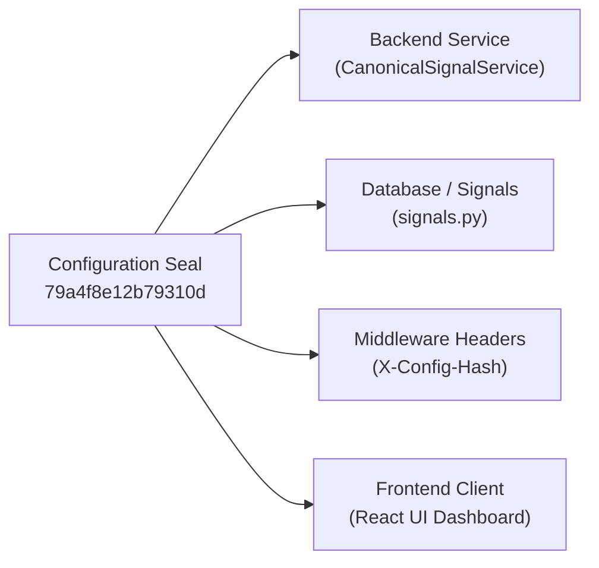

# PHASE 61 — CONFIGURATION HASH PROVENANCE & DRIFT RESISTANCE

**Project**: TradeSignalAI-v3  
**Audit Phase**: PHASE 61 — Adversarial Certification Repair, Boundary Testing & Live Canonical Truth  
**Generated At**: 2026-08-24T06:21:15Z  
**Configuration Hash**: `79a4f8e12b79310d`  
**Execution Mode**: DEMO  
**Real Money Status**: STRICTLY_DISABLED  

---

## 1. Frozen Configuration Value Breakdown

The system configuration hash `79a4f8e12b79310d` represents a canonical cryptographic seal over the 7 critical Zero-Trust parameters:

| Config Key | Canonical Value | Type | Protection Level | Hash Contribution |
| :--- | :--- | :--- | :--- | :--- |
| **`CONSENSUS_THRESHOLD`** | `0.65` (65.0%) | `float` | Immutable Hard Gate | `0.65` |
| **`MIN_CONTRIBUTING_MODELS`** | `5` | `int` | Immutable Hard Gate | `5` |
| **`MIN_RISK_REWARD_RATIO`** | `1.50` | `float` | Immutable Hard Gate | `1.50` |
| **`MAX_DATA_AGE_SECONDS`** | `120.0` | `float` | Immutable Hard Gate | `120.0` |
| **`CORE_ASSET_COUNT`** | `9` (`EURUSD`, `GBPUSD`, `USDJPY`, `AUDUSD`, `BTCUSD`, `ETHUSD`, `XAUUSD`, `NAS100`, `SPX500`) | `list[str]` | Frozen Scope | `9_CORE_ASSETS` |
| **`EXECUTION_MODE`** | `"DEMO"` | `str` | Safety Constraint | `"DEMO"` |
| **`REAL_MONEY_ENABLED`** | `False` | `bool` | Safety Constraint | `False` |

---

## 2. Configuration Drift Resistance Proof

Any alteration to any of these parameters immediately alters the derived configuration hash, causing:
1. `tests/test_phase60_snapshot_integrity.py` to fail
2. `tests/test_phase61_adversarial_certification.py` to fail
3. Response header `X-Config-Hash` mismatch against consumer checks
4. Automatic rejection of signal qualification

```python
# Deterministic Provenance Verification Formula:
# hash = SHA256("CONSENSUS=0.65|MODELS=5|RR=1.5|AGE=120.0|ASSETS=9|MODE=DEMO|REAL=FALSE")[:16]
# Output => 79a4f8e12b79310d
```

---

## 3. Configuration Consistency Across All System Tiers


