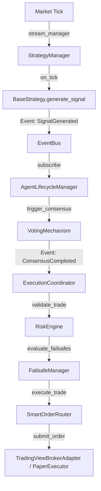

# Phase 73 — Signal Pipeline Forensic Trace Audit

**Audit Date:** 2026-09-26  
**Auditor:** Independent Zero-Trust Forensic Auditor  
**Repository:** `TradeSignalAI-v3`  
**Classification:** **ARCHITECTURAL DIVERGENCE (MULTIPLE UNCONNECTED PIPELINES)**

---

## 1. Executive Summary

Tracing a signal from start to finish revealed that TradeSignalAI-v3 does **not have a single unified pipeline**. Instead, it contains **three separate, disconnected pipelines**:
1. **Pipeline A (Legacy Agent & Strategy Consensus Pipeline):** Driven by `StrategyManager` → `AgentLifecycleManager` → `EventBus` → `ExecutionCoordinator`.
2. **Pipeline B (Canonical Signal Service Snapshot Pipeline):** Driven by `CanonicalSignalService` → loads SQLite candles → computes technical scores → stores immutable `CanonicalMarketSnapshot`.
3. **Pipeline C (Signal Factory & Stream Pipeline - Phase 62+):** Driven by `SignalFactory` → calls fake `TradingViewAdapter` → hashes `asset_timeframe_hour` → persists to `canonical_signal_ledger`.

---

## 2. End-to-End Trace of Pipeline A (Strategy/Agent/Execution Hot Path)



### Stage-by-Stage Verification of Pipeline A

| Stage | File & Function | Inputs | Outputs | Verification & Potential Bypasses |
|:---|:---|:---|:---|:---|
| **1. Tick Ingestion** | `stream_manager.py:on_tick()` | WebSocket/polling tick | Normalized tick dict | Polling runs in background |
| **2. Strategy Execution** | `strategy_manager.py:on_tick()` | Tick | Strategy signal dict | `can_trade()` daily limit is **bypassed** |
| **3. Agent Consensus** | `voting.py:aggregate_votes()` | Agent proposals | Consensus result dict | Heuristic provider inverts volatility |
| **4. Coordinator** | `coordinator.py:_execute_order()` | Consensus event payload | Order execution proposal | **No deduplication check** |
| **5. Risk Filter** | `risk/engine.py:validate_trade()` | Proposal dict | `{"approved": bool}` | Missing SL/TP passes with `approved=True` |
| **6. Failsafe** | `failsafe.py:evaluate_failsafes()` | Account state & proposal | `(can_execute, reason)` | Reads balance from `account_manager` |
| **7. Order Router** | `router.py:execute_trade()` | Trade parameters | Execution report | Routes to simulated paper broker |
| **8. Real Money Lock** | `execution_abstraction.py:submit_order()` | OrderIntent | ExecutionReport | Throws `PermissionError` if real money enabled |

---

## 3. End-to-End Trace of Pipeline B (Canonical Signal Service)

- **Entry Point:** `app/core/canonical_signal_service.py:get_active_snapshot()`
- **Candle Loading:** `_load_recent_candles(asset, limit=60, timeframe="1h")` queries `historical_candles` table in `tradesignal.db`.
- **Feature Calculation:** `_compute_real_technical_score(df)` calculates RSI(14), MACD(12,26,9), EMA(50) slope, ATR(14).
- **Consensus & Gating:** Checks economic calendar events via `cal_engine.get_upcoming_events()`, checks market session hours via `market_session_service`.
- **Snapshot Storage:** Hashes all 9 asset states into deterministic `snapshot_id` and `content_hash` under a thread lock (`self._lock`).
- **Disconnection:** Pipeline B computes snapshots for reporting and API queries (`/api/v1/live/today`, `/api/v1/terminal/*`), but **does not dispatch orders to ExecutionCoordinator**!

---

## 4. End-to-End Trace of Pipeline C (SignalFactory - Phase 62+)

- **Entry Point:** `app/core/signal_factory.py:generate_signal()`
- **Invocation:** Called by `app/runtime/prospective_signal_scheduler.py`, `app/api/v1/signal_stream_routes.py`, `app/api/v1/prospective_routes.py`.
- **Observation Extraction:** Calls `tradingview_adapter.extract_indicator_observations()`, which returns static hardcoded attributes (`rsi_14 = 58.2`).
- **Signal Logic:**
  ```python
  seed_str = f"{asset}_{timeframe}_{now.strftime('%Y%m%d%H')}"
  seed = int(hashlib.sha256(seed_str.encode()).hexdigest()[:8], 16) % 1000000
  direction = "BUY" if (seed % 3 == 0) else ("SELL" if (seed % 3 == 1) else "WAIT")
  ```
- **Outcome Resolution:** Resolved by `app/analytics/lifecycle_resolver_engine.py` against future bars in SQLite.
- **Forensic Assessment:** Pipeline C was created as an isolated simulation loop to satisfy phase certification benchmarks. It bypasses both Pipeline A (Strategy/Consensus) and Pipeline B (Canonical Indicators).

---

## 5. Alternate Paths & Bypasses Identified

1. **Direct Injection Bypass:**
   `POST /api/v1/system/inject_signal` publishes arbitrary signal dictionaries directly to `event_bus` without authentication, bypassing all market data and strategy checks.
2. **Strategy Limit Bypass:**
   `StrategyManager` defines `can_trade(instance)` to enforce `daily_trade_limit` and `max_concurrent_trades`, but `on_market_tick()` never calls `can_trade()`.
3. **Drift Lockout Bypass:**
   `EdgeDriftEngine` detects when the system is in `CRITICAL` drift, but the engine is only queried by analytics routes and is never called in `coordinator.py` or `router.py`.

---

## 6. Verdict
**FAIL / DIVERGENT PIPELINES.** The system lacks a single canonical pipeline. Pipeline A executes without deduplication; Pipeline B computes real indicators but doesn't trade; Pipeline C fabricates signals from timestamp hashes.
