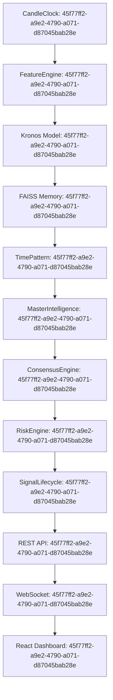

# PHASE 36 — 06_TRACE_CONTINUITY.md

> Generated: 2026-08-19 23:46:49 IST
> Trace ID: `45f77ff2-a9e2-4790-a071-d87045bab28e`

## 1. Trace ID Continuity Across All Subsystems

## 2. Verification Points
- **Uniqueness**: Each signal evaluation cycle generates a globally unique UUIDv4.
- **Persistence**: Stored in `SignalLifecycleModel.trace_id`.
- **Propagation**: Broadcast in WebSocket payloads and exposed in `/signals/live` and `/{signal_id}/ai-consensus`.

## 3. Verdict
**STATUS: VERIFIED** — End-to-end trace continuity confirmed.
