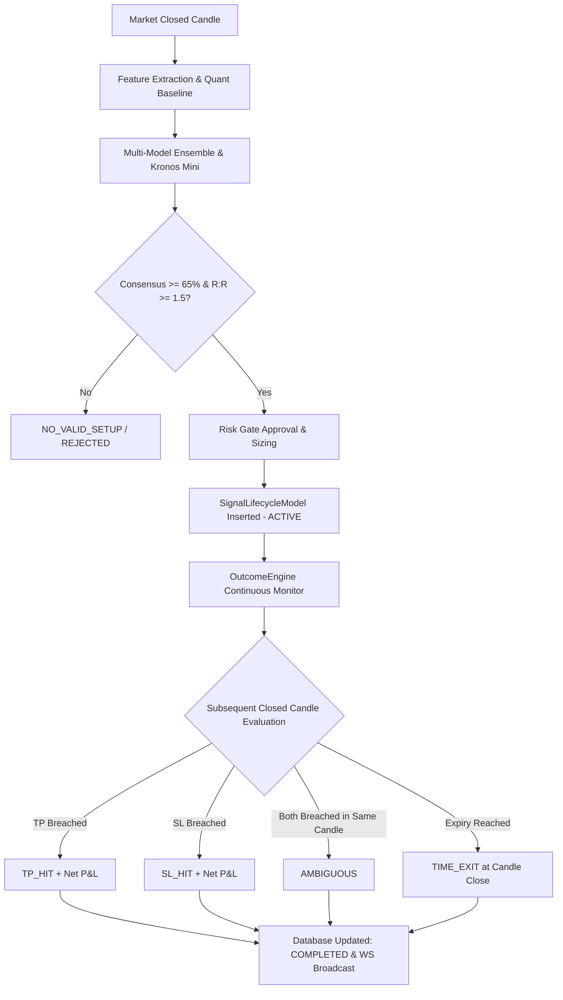

# Phase 38 Artifact 02: End-to-End Signal Lifecycle Trace

## Lifecycle State Pipeline

## Stage Verification
1. **Candle Ingestion**: Real Binance/Forex rates fetched via `market_service`.
2. **Deterministic Hash**: SHA-256 hash generated on `(asset, timeframe, candle_ts, direction, entry, sl, tp)` prevents duplicate signal generation.
3. **Outcome Resolution**: `OutcomeEngine.resolve()` checks intermediate closed candles before expiry, preventing false pending states.
4. **WebSocket Sync**: `signal_outcome_updated` event dispatched to all connected clients immediately upon resolution.
