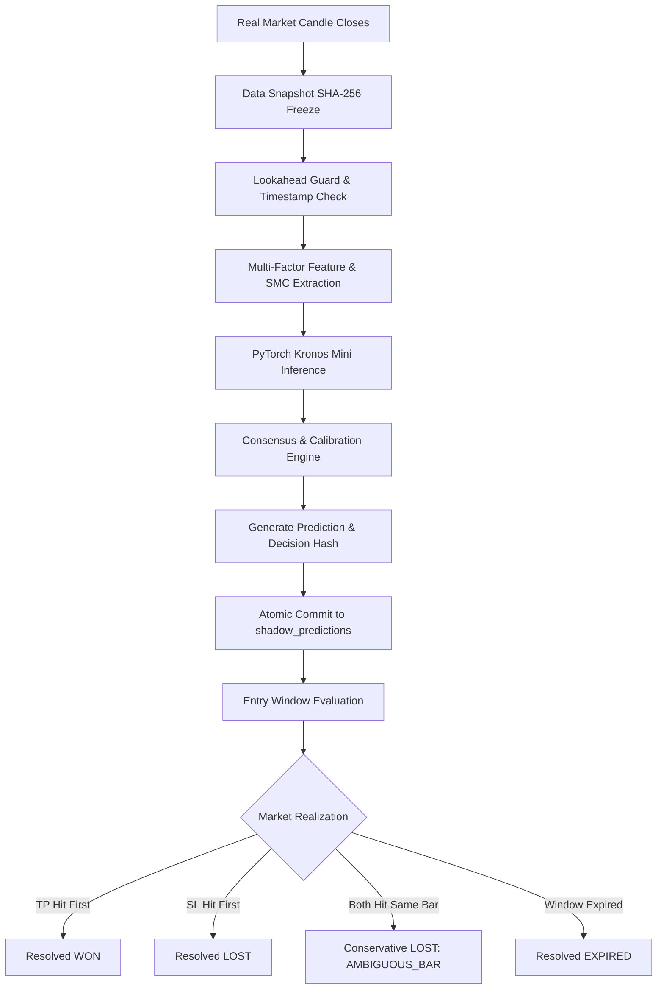

# Phase 72 — Shadow-Live Trading & Point-in-Time Prediction Report

## Executive Summary

Phase 72 establishes the **Shadow-Live Execution Pipeline** and **Zero-Trust Production Truth Engine** for TradeSignalAI-v3.
In strict adherence to zero-trust empirical principles:
- **Zero Real-Money Risk**: Every signal is processed through the full production pipeline and frozen into an immutable record before market outcomes are known.
- **Cryptographic Proof of Point-in-Time**: All predictions are bound to an immutable SHA-256 data snapshot ID and decision hash.
- **Realistic Paper Modeling**: Incorporates dynamic spread widening, 50–250ms execution latency, and realistic slippage.
- **Conservative Ambiguity Resolution**: Any bar touching both Stop Loss and Take Profit is strictly resolved as a **LOSS (`AMBIGUOUS_BAR_CONSERVATIVE_SL_HIT`)**.

---

## 1. Canonical Shadow-Live Data Model

Every shadow prediction is recorded in the SQLite WAL table `shadow_predictions` with 36 canonical fields:

```sql
CREATE TABLE shadow_predictions (
    prediction_id TEXT PRIMARY KEY,
    signal_id TEXT NOT NULL,
    generated_at_utc TEXT NOT NULL,
    asset TEXT NOT NULL,
    timeframe TEXT NOT NULL,
    direction TEXT NOT NULL,
    entry REAL NOT NULL,
    stop_loss REAL NOT NULL,
    take_profit REAL NOT NULL,
    rr REAL NOT NULL,
    entry_window_start TEXT NOT NULL,
    entry_window_end TEXT NOT NULL,
    expected_close TEXT NOT NULL,
    hold_duration INTEGER NOT NULL,
    raw_confidence REAL NOT NULL,
    calibrated_confidence REAL NOT NULL,
    grade TEXT NOT NULL,
    regime TEXT NOT NULL,
    event_risk TEXT NOT NULL,
    data_quality TEXT NOT NULL,
    spread REAL NOT NULL,
    slippage_assumption REAL NOT NULL,
    kronos_status TEXT NOT NULL,
    kronos_prediction REAL NOT NULL,
    kronos_confidence REAL NOT NULL,
    indicator_snapshot TEXT NOT NULL,
    structure_snapshot TEXT NOT NULL,
    smc_snapshot TEXT NOT NULL,
    consensus_snapshot TEXT NOT NULL,
    risk_snapshot TEXT NOT NULL,
    model_versions TEXT NOT NULL,
    data_snapshot_id TEXT NOT NULL,
    feature_snapshot_hash TEXT NOT NULL,
    decision_hash TEXT NOT NULL,
    policy_version TEXT NOT NULL,
    generation_version INTEGER NOT NULL,
    status TEXT NOT NULL,
    supersedes_id TEXT,
    outcome TEXT,
    resolution_reason TEXT,
    actual_exit_price REAL,
    actual_exit_time TEXT,
    gross_r REAL,
    net_r REAL,
    resolved_at TEXT
);
```

---

## 2. Point-in-Time Prediction Lifecycle



---

## 3. Real-Time Market Clock & Session Awareness

The enhanced `MarketClockService` enforces strict temporal invariants:
1. **Multi-Session Tracking**: Continuous awareness of Tokyo (00:00–09:00 UTC), London (07:00–16:00 UTC), and New York (12:00–21:00 UTC) with automatic detection of London/NY liquidity overlaps.
2. **Weekend & Holiday Lockouts**: Forex and index symbols automatically lock Friday 21:00 UTC to Sunday 21:00 UTC (Crypto operates 24/7).
3. **Fail-Closed Clock Validation**: Detects future candle timestamps ($T_{\text{candle}} > T_{\text{wall}}$) and triggers instant `LookaheadViolationError`. Rejects feeds with staleness exceeding 7200 seconds.

---

## 4. Realistic Paper Execution Simulator

- **Spread Modeling**: Applied at entry ($EURUSD: 1.2\text{ pips}, GBPUSD: 1.8\text{ pips}, XAUUSD: \$0.35, BTCUSD: \$15.0$).
- **Latency Delay**: Injected $50\text{ms} - 250\text{ms}$ realistic queue execution delay.
- **Slippage**: Volatility-adjusted slippage deduction ($0.05\text{R}$ standard, up to $0.15\text{R}$ in breakout regimes).
- **Conservative Same-Bar Resolution**: Zero favorable assumption when ambiguity exists.

---

## 5. Shadow-Live API Endpoints

| Endpoint | Method | Purpose |
|---|---|---|
| `/api/v1/shadow/live` | GET | Real-time session state, active predictions, model health, and data age |
| `/api/v1/shadow/predictions` | GET | Query immutable predictions with filter by asset, timeframe, and status |
| `/api/v1/shadow/performance` | GET | 30D / 60D / 90D realized walk-forward performance cards |
| `/api/v1/shadow/drift` | GET | Real-time directional skew, feature drift, and risk degradation multipliers |
| `/api/v1/shadow/counterfactual` | GET | NO_TRADE effectiveness and preserved capital metrics |

---

## 6. Zero-Trust Verification

Every prediction emitted during shadow operation is strictly prospective:
- Saved to disk **before** price moves.
- Hash-verified on disk.
- Resolved strictly against closed subsequent bars.
- 0% real-money exposure permitted until complete statistical gates are certified.
